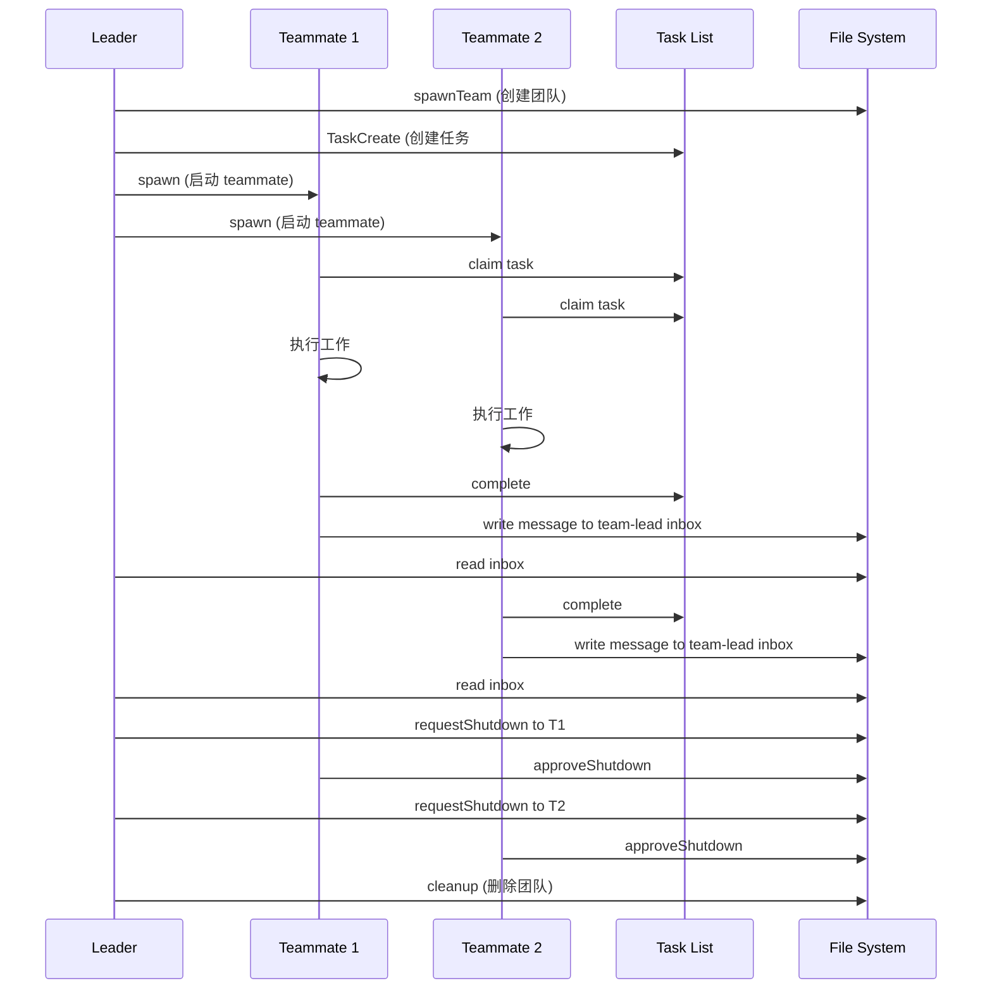

# 14. Agent Teams - 多会话编排官方指南

> 基于 Claude Code 官方文档和社区最佳实践整理

## 目录
- [14.1 Agent Teams 概述](#141-agent-teams-概述)
- [14.2 核心概念与架构](#142-核心概念与架构)
- [14.3 启用 Agent Teams](#143-启用-agent-teams)
- [14.4 TeammateTool 工具详解](#144-teammatetool-工具详解)
- [14.5 任务系统集成](#145-任务系统集成)
- [14.6 消息通信机制](#146-消息通信机制)
- [14.7 编排模式](#147-编排模式)
- [14.8 Subagent vs Agent Teams](#148-subagent-vs-agent-teams)
- [14.9 最佳实践](#149-最佳实践)
- [14.10 完整工作流示例](#1410-完整工作流示例)

---

## 14.1 Agent Teams 概述

### 什么是 Agent Teams？

**Agent Teams** 是 Claude Code 的实验性功能，允许多个**独立的 Claude Code 会话**作为团队协同工作，通过共享任务列表和消息系统进行协调。

```yaml
关键特征:
  - 每个 teammate 是一个完整的 Claude Code 实例
  - 每个有独立的上下文窗口
  - 通过文件系统（JSON）进行通信
  - 一个 leader 协调多个 teammates
  - 共享任务队列和状态
```

### Agent Teams vs Subagent

这是**完全不同**的两个概念：

| 特性 | Subagent (Task tool) | Agent Teams |
|------|---------------------|-------------|
| **本质** | 单个会话内的子进程 | 多个独立会话 |
| **上下文** | 共享主会话上下文 | 每个独立上下文窗口 |
| **通信** | 返回值 | 文件系统消息（inbox） |
| **可见性** | 用户看不到 | 用户可直接交互 |
| **生命周期** | 任务完成即结束 | 持续运行直到关闭 |
| **协作** | 向主代理报告 | 可互相通信 |
| **工具** | Task tool | TeammateTool |

### Agent Teams 的架构图

```
┌────────────────────────────────────────────────────────┐
│                   Agent Teams 架构                      │
├────────────────────────────────────────────────────────┤
│                                                         │
│   你的终端（Leader Session）                             │
│   ┌──────────────────────────┐                         │
│   │ team-lead@my-project     │                         │
│   │ - 创建团队                │                         │
│   │ - 协调工作                │                         │
│   │ - 接收消息                │                         │
│   └────────┬─────────────────┘                         │
│            │                                            │
│   ┌────────┴────────────────┐                          │
│   │ TeammateTool             │                          │
│   │ - spawn                  │                          │
│   │ - write/broadcast        │                          │
│   │ - requestShutdown        │                          │
│   └──────────────────────────┘                         │
│            │                                            │
│   ┌────────▼────────────────────────┐                  │
│   │  ~/.claude/teams/my-project/    │                  │
│   │  ├── config.json  (团队配置)     │                  │
│   │  └── inboxes/                   │                  │
│   │      ├── team-lead.json         │                  │
│   │      ├── worker-1.json          │                  │
│   │      └── worker-2.json          │                  │
│   │                                 │                  │
│   │  ~/.claude/tasks/my-project/    │                  │
│   │  ├── 1.json  (任务 #1)          │                  │
│   │  ├── 2.json  (任务 #2)          │                  │
│   │  └── 3.json  (任务 #3)          │                  │
│   └─────────────────────────────────┘                  │
│            │                                            │
│   ┌────────┴─────────────┬─────────────┐              │
│   │                      │             │              │
│   ▼                      ▼             ▼              │
│ ┌──────┐              ┌──────┐     ┌──────┐          │
│ │Worker│              │Worker│     │Worker│          │
│ │  1   │              │  2   │     │  3   │          │
│ │      │◄────消息─────►│      │     │      │          │
│ └──────┘              └──────┘     └──────┘          │
│  独立会话               独立会话      独立会话          │
│  独立终端               独立终端      独立终端          │
│  独立上下文             独立上下文    独立上下文        │
│                                                         │
└────────────────────────────────────────────────────────┘
```

---

## 14.2 核心概念与架构

### 核心组件

| 组件 | 说明 | 位置 |
|------|------|------|
| **Team** | 一个命名的代理组，一个 leader + 多个 teammates | `~/.claude/teams/{name}/` |
| **Leader** | 创建团队的代理，接收消息，审批计划 | 你的当前会话 |
| **Teammate** | 加入团队的代理，独立工作，通过 inbox 通信 | 独立的 Claude Code 会话 |
| **Task** | 共享任务队列中的工作项 | `~/.claude/tasks/{team}/N.json` |
| **Inbox** | 代理接收消息的 JSON 文件 | `~/.claude/teams/{name}/inboxes/{agent}.json` |
| **Message** | 代理间发送的 JSON 对象 | 存储在 inbox 文件中 |

### 文件系统结构

```
~/.claude/
├── teams/
│   └── my-project/
│       ├── config.json          # 团队元数据
│       └── inboxes/
│           ├── team-lead.json   # Leader 的收件箱
│           ├── worker-1.json    # Worker 1 的收件箱
│           └── worker-2.json    # Worker 2 的收件箱
│
└── tasks/
    └── my-project/
        ├── 1.json               # 任务 #1
        ├── 2.json               # 任务 #2
        └── 3.json               # 任务 #3
```

### 团队配置文件示例

`~/.claude/teams/my-project/config.json`:

```json
{
  "name": "my-project",
  "description": "Working on feature X",
  "leadAgentId": "team-lead@my-project",
  "createdAt": 1706000000000,
  "members": [
    {
      "agentId": "team-lead@my-project",
      "name": "team-lead",
      "agentType": "team-lead",
      "color": "#4A90D9",
      "joinedAt": 1706000000000,
      "backendType": "in-process"
    },
    {
      "agentId": "worker-1@my-project",
      "name": "worker-1",
      "agentType": "Explore",
      "model": "haiku",
      "prompt": "Analyze the codebase structure...",
      "color": "#D94A4A",
      "joinedAt": 1706000001000,
      "cwd": "/Users/me/project",
      "backendType": "tmux"
    }
  ]
}
```

### 通信流程图



---

## 14.3 启用 Agent Teams

### 配置方法

Agent Teams 是实验性功能，默认禁用。启用方法：

#### 方法 1：settings.json

在 `~/.claude/settings.json` 中添加：

```json
{
  "CLAUDE_CODE_EXPERIMENTAL_AGENT_TEAMS": "true"
}
```

#### 方法 2：环境变量

```bash
export CLAUDE_CODE_EXPERIMENTAL_AGENT_TEAMS=true
claude-code
```

### 验证启用状态

启用后，你可以使用 `TeammateTool`：

```javascript
Teammate({ operation: "discoverTeams" })
```

如果返回结果（即使是空列表），说明启用成功。

---

## 14.4 TeammateTool 工具详解

### 1. spawnTeam - 创建团队

```javascript
Teammate({
  operation: "spawnTeam",
  team_name: "feature-auth",
  description: "Implementing OAuth2 authentication"
})
```

**效果：**
- 创建 `~/.claude/teams/feature-auth/config.json`
- 创建 `~/.claude/tasks/feature-auth/` 目录
- 你成为 team leader

### 2. discoverTeams - 发现可加入的团队

```javascript
Teammate({ operation: "discoverTeams" })
```

**返回：** 你尚未加入的团队列表

### 3. requestJoin - 请求加入团队

```javascript
Teammate({
  operation: "requestJoin",
  team_name: "feature-auth",
  proposed_name: "helper",
  capabilities: "I can help with code review and testing"
})
```

**注意：** 需要 leader 批准

### 4. approveJoin - 批准加入请求（Leader 专用）

收到 `join_request` 消息后：

```javascript
Teammate({
  operation: "approveJoin",
  target_agent_id: "helper",
  request_id: "join-123"
})
```

### 5. rejectJoin - 拒绝加入请求（Leader 专用）

```javascript
Teammate({
  operation: "rejectJoin",
  target_agent_id: "helper",
  request_id: "join-123",
  reason: "Team is at capacity"
})
```

### 6. write - 发送消息给指定 teammate

```javascript
Teammate({
  operation: "write",
  target_agent_id: "security-reviewer",
  value: "Please prioritize the authentication module. Deadline is tomorrow."
})
```

**重要：** Teammates 的文本输出不会自动发送给 leader，必须使用 `write` 操作！

### 7. broadcast - 广播消息给所有 teammates

```javascript
Teammate({
  operation: "broadcast",
  name: "team-lead",  // 你的名字
  value: "Status check: Please report your progress"
})
```

**警告：** 广播成本高（N 个 teammates = N 条消息）

**何时使用：**
- 紧急问题需要立即响应
- 影响所有人的重大公告

**何时不用：**
- 回复单个 teammate
- 正常一对一交流
- 只与部分人相关的信息

### 8. requestShutdown - 请求 teammate 退出（Leader 专用）

```javascript
Teammate({
  operation: "requestShutdown",
  target_agent_id: "security-reviewer",
  reason: "All tasks complete, wrapping up"
})
```

### 9. approveShutdown - 同意关闭（Teammate 专用）

收到 `shutdown_request` 消息后，**必须**调用：

```javascript
Teammate({
  operation: "approveShutdown",
  request_id: "shutdown-123"
})
```

这会发送确认并终止进程。

### 10. rejectShutdown - 拒绝关闭（Teammate 专用）

```javascript
Teammate({
  operation: "rejectShutdown",
  request_id: "shutdown-123",
  reason: "Still working on task #3, need 5 more minutes"
})
```

### 11. approvePlan - 批准计划（Leader 专用）

Teammate 设置了 `plan_mode_required` 时会发送计划请求：

```javascript
Teammate({
  operation: "approvePlan",
  target_agent_id: "architect",
  request_id: "plan-456"
})
```

### 12. rejectPlan - 拒绝计划并提供反馈（Leader 专用）

```javascript
Teammate({
  operation: "rejectPlan",
  target_agent_id: "architect",
  request_id: "plan-456",
  feedback: "Please add error handling for API calls and consider rate limiting"
})
```

### 13. cleanup - 清理团队资源

```javascript
Teammate({ operation: "cleanup" })
```

**删除：**
- `~/.claude/teams/{team-name}/` 目录
- `~/.claude/tasks/{team-name}/` 目录

**重要：** 如果 teammates 仍在运行会失败。先用 `requestShutdown`。

---

## 14.5 任务系统集成

### 创建任务

```javascript
TaskCreate({
  subject: "Review authentication module",
  description: "Review all files in app/services/auth/ for security vulnerabilities",
  activeForm: "Reviewing auth module..."  // 任务进行中时显示的文本
})
```

### 查看所有任务

```javascript
TaskList()
```

返回示例：
```
#1 [completed] Analyze codebase structure
#2 [in_progress] Review authentication module (owner: security-reviewer)
#3 [pending] Generate summary report [blocked by #2]
```

### 获取任务详情

```javascript
TaskGet({ taskId: "2" })
```

### 更新任务状态

```javascript
// 认领任务
TaskUpdate({ taskId: "2", owner: "security-reviewer" })

// 开始工作
TaskUpdate({ taskId: "2", status: "in_progress" })

// 标记完成
TaskUpdate({ taskId: "2", status: "completed" })

// 设置依赖关系
TaskUpdate({ taskId: "3", addBlockedBy: ["1", "2"] })
```

### 任务依赖与自动解锁

当阻塞任务完成时，被阻塞的任务自动解锁：

```javascript
// 创建流水线
TaskCreate({ subject: "Step 1: Research" })        // #1
TaskCreate({ subject: "Step 2: Implement" })       // #2
TaskCreate({ subject: "Step 3: Test" })            // #3

// 设置依赖
TaskUpdate({ taskId: "2", addBlockedBy: ["1"] })   // #2 等待 #1
TaskUpdate({ taskId: "3", addBlockedBy: ["2"] })   // #3 等待 #2

// 当 #1 完成，#2 自动解锁
// 当 #2 完成，#3 自动解锁
```

### 任务文件结构

`~/.claude/tasks/my-project/1.json`:

```json
{
  "id": "1",
  "subject": "Review authentication module",
  "description": "Review all files in app/services/auth/...",
  "status": "in_progress",
  "owner": "security-reviewer",
  "activeForm": "Reviewing auth module...",
  "blockedBy": [],
  "blocks": ["3"],
  "createdAt": 1706000000000,
  "updatedAt": 1706000001000
}
```

---

## 14.6 消息通信机制

### 普通消息

```json
{
  "from": "team-lead",
  "text": "Please prioritize the auth module",
  "timestamp": "2026-01-25T23:38:32.588Z",
  "read": false
}
```

### 结构化消息类型

#### 1. Shutdown Request

```json
{
  "type": "shutdown_request",
  "requestId": "shutdown-abc123@worker-1",
  "from": "team-lead",
  "reason": "All tasks complete",
  "timestamp": "2026-01-25T23:38:32.588Z"
}
```

#### 2. Shutdown Approved

```json
{
  "type": "shutdown_approved",
  "requestId": "shutdown-abc123@worker-1",
  "from": "worker-1",
  "paneId": "%5",
  "backendType": "in-process",
  "timestamp": "2026-01-25T23:39:00.000Z"
}
```

#### 3. Idle Notification（自动发送）

Teammate 停止工作时自动发送：

```json
{
  "type": "idle_notification",
  "from": "worker-1",
  "timestamp": "2026-01-25T23:40:00.000Z",
  "completedTaskId": "2",
  "completedStatus": "completed"
}
```

#### 4. Task Completed

```json
{
  "type": "task_completed",
  "from": "worker-1",
  "taskId": "2",
  "taskSubject": "Review authentication module",
  "timestamp": "2026-01-25T23:40:00.000Z"
}
```

#### 5. Plan Approval Request

```json
{
  "type": "plan_approval_request",
  "from": "architect",
  "requestId": "plan-xyz789",
  "planContent": "# Implementation Plan\n\n1. ...",
  "timestamp": "2026-01-25T23:41:00.000Z"
}
```

#### 6. Join Request

```json
{
  "type": "join_request",
  "proposedName": "helper",
  "requestId": "join-abc123",
  "capabilities": "Code review and testing",
  "timestamp": "2026-01-25T23:42:00.000Z"
}
```

---

## 14.7 编排模式

### 模式 1：并行专家评审（Leader 模式）

多个专家同时评审代码：

```javascript
// 1. 创建团队
Teammate({ operation: "spawnTeam", team_name: "code-review" })

// 2. 并行启动专家（在单个消息中调用多次 Task）
Task({
  team_name: "code-review",
  name: "security",
  subagent_type: "Explore",  // 或使用专业的审查代理
  prompt: "Review the PR for security vulnerabilities. Focus on: SQL injection, XSS, auth bypass. Send findings to team-lead using Teammate write.",
  run_in_background: true
})

Task({
  team_name: "code-review",
  name: "performance",
  subagent_type: "Explore",
  prompt: "Review the PR for performance issues. Focus on: N+1 queries, memory leaks, slow algorithms. Send findings to team-lead using Teammate write.",
  run_in_background: true
})

Task({
  team_name: "code-review",
  name: "simplicity",
  subagent_type: "Explore",
  prompt: "Review the PR for unnecessary complexity. Focus on: over-engineering, premature abstraction. Send findings to team-lead using Teammate write.",
  run_in_background: true
})

// 3. 等待结果（检查 inbox）
// 4. 综合发现并清理
Teammate({ operation: "requestShutdown", target_agent_id: "security" })
Teammate({ operation: "requestShutdown", target_agent_id: "performance" })
Teammate({ operation: "requestShutdown", target_agent_id: "simplicity" })
// 等待批准...
Teammate({ operation: "cleanup" })
```

### 模式 2：流水线（顺序依赖）

每个阶段依赖前一个：

```javascript
// 1. 创建团队和任务流水线
Teammate({ operation: "spawnTeam", team_name: "feature-pipeline" })

TaskCreate({ subject: "Research", description: "Research best practices", activeForm: "Researching..." })
TaskCreate({ subject: "Plan", description: "Create implementation plan", activeForm: "Planning..." })
TaskCreate({ subject: "Implement", description: "Implement the feature", activeForm: "Implementing..." })
TaskCreate({ subject: "Test", description: "Write and run tests", activeForm: "Testing..." })

// 设置顺序依赖
TaskUpdate({ taskId: "2", addBlockedBy: ["1"] })
TaskUpdate({ taskId: "3", addBlockedBy: ["2"] })
TaskUpdate({ taskId: "4", addBlockedBy: ["3"] })

// 2. 启动 workers 认领并完成任务
Task({
  team_name: "feature-pipeline",
  name: "researcher",
  subagent_type: "Explore",
  prompt: "Claim task #1, research best practices, complete it, send findings to team-lead using Teammate write. Then check for more work.",
  run_in_background: true
})

Task({
  team_name: "feature-pipeline",
  name: "implementer",
  subagent_type: "general-purpose",
  prompt: "Poll TaskList every 30 seconds. When task #3 unblocks, claim it and implement. Complete and notify team-lead using Teammate write.",
  run_in_background: true
})

// 任务会随依赖完成自动解锁
```

### 模式 3：自组织群集（Swarm）

Workers 从任务池中抢任务：

```javascript
// 1. 创建团队和任务池
Teammate({ operation: "spawnTeam", team_name: "file-review-swarm" })

// 创建多个独立任务（无依赖）
for (const file of ["auth.rb", "user.rb", "api_controller.rb", "payment.rb"]) {
  TaskCreate({
    subject: `Review ${file}`,
    description: `Review ${file} for security and code quality`,
    activeForm: `Reviewing ${file}...`
  })
}

// 2. 启动 worker 群集
const workerPrompt = `
You are a swarm worker. Your job:
1. Call TaskList to see available tasks
2. Find a task with status 'pending' and no owner
3. Claim it with TaskUpdate (set owner to your name)
4. Do the work
5. Mark completed with TaskUpdate
6. Send findings to team-lead via Teammate write operation
7. Repeat until no tasks remain
`;

Task({
  team_name: "file-review-swarm",
  name: "worker-1",
  subagent_type: "general-purpose",
  prompt: workerPrompt,
  run_in_background: true
})

Task({
  team_name: "file-review-swarm",
  name: "worker-2",
  subagent_type: "general-purpose",
  prompt: workerPrompt,
  run_in_background: true
})

Task({
  team_name: "file-review-swarm",
  name: "worker-3",
  subagent_type: "general-purpose",
  prompt: workerPrompt,
  run_in_background: true
})

// Workers 竞争认领任务，自然负载均衡
```

### 模式 4：研究 + 实施

先研究，再实施：

```javascript
// 1. 研究阶段（同步，返回结果）
const research = await Task({
  subagent_type: "Explore",
  description: "Research caching patterns",
  prompt: "Research best practices for implementing caching in Rails APIs. Include: cache invalidation, Redis vs Memcached, cache key design."
})

// 2. 使用研究结果指导实施
Task({
  subagent_type: "general-purpose",
  description: "Implement caching",
  prompt: `
    Implement API caching based on this research:

    ${research.content}

    Focus on the user_controller.rb endpoints.
  `
})
```

---

## 14.8 Subagent vs Agent Teams

### 两种启动方式对比

#### 方式 1：Task Tool（Subagent）

用于**短期、专注的工作**，返回结果：

```javascript
Task({
  subagent_type: "Explore",
  description: "Find auth files",
  prompt: "Find all authentication-related files in this codebase",
  model: "haiku"
})
```

**特点：**
- 同步运行（阻塞直到完成）或异步 `run_in_background: true`
- 直接返回结果
- 不需要团队成员资格
- 适合：搜索、分析、专注研究

#### 方式 2：Task Tool + team_name + name（Teammate）

用于**启动持久 teammates**：

```javascript
// 首先创建团队
Teammate({ operation: "spawnTeam", team_name: "my-project" })

// 然后启动 teammate 加入团队
Task({
  team_name: "my-project",        // 必需：加入哪个团队
  name: "security-reviewer",      // 必需：teammate 的名字
  subagent_type: "Explore",
  prompt: "Review all auth code for vulnerabilities. Send findings to team-lead via Teammate write.",
  run_in_background: true         // Teammates 通常后台运行
})
```

**特点：**
- 加入团队，出现在 `config.json`
- 通过 inbox 消息通信
- 可从共享任务列表认领任务
- 持续运行直到关闭
- 适合：并行工作、持续协作、流水线阶段

### 关键差异表

| 方面 | Task (subagent) | Task + team_name + name (teammate) |
|------|-----------------|-----------------------------------|
| **生命周期** | 直到任务完成 | 直到请求关闭 |
| **通信** | 返回值 | Inbox 消息 |
| **任务访问** | 无 | 共享任务列表 |
| **团队成员** | 否 | 是 |
| **协调** | 一次性 | 持续 |
| **用户可见** | 否（在后台） | 是（独立会话） |
| **上下文窗口** | 共享主会话 | 独立上下文 |

### 何时使用哪种？

```yaml
使用 Subagent（Task tool）当：
  - 需要快速、专注的工作并返回结果
  - 一次性操作
  - 不需要与其他代理协作
  - 简单的搜索、分析任务

使用 Agent Teams 当：
  - Teammates 需要共享发现
  - 互相挑战和讨论
  - 自主协调工作
  - 复杂的多阶段流水线
  - 需要从多个角度分析问题
```

---

## 14.9 最佳实践

### 1. 何时使用 Agent Teams

✅ **适合使用 Agent Teams：**

- 研究和评审（多个专家并行审查）
- 新模块或功能（前端 + 后端 + 测试并行开发）
- 调试竞争假设（多个 debuggers 尝试不同方法）
- 跨层协调（frontend + backend + database 团队）
- 大规模并行任务（100+ 文件需要处理）

❌ **不适合 Agent Teams：**

- 简单的单一任务
- 高度串行的工作流
- Token 预算受限
- 需要快速响应的小任务

### 2. Token 使用考虑

⚠️ **警告：** Agent Teams 使用的 token 明显多于单个会话

```yaml
原因:
  - 每个 teammate 有独立的上下文窗口
  - Token 使用随 teammates 数量线性增长
  - 消息通信也消耗 token

建议:
  - 从少量 teammates 开始（2-3 个）
  - 监控 token 使用
  - 使用 haiku 模型降低成本
  - 明确任务边界避免重复工作
```

### 3. 通信最佳实践

```yaml
优先使用 write（点对点）:
  - 明确、直接
  - Token 效率高
  - 避免信息过载

谨慎使用 broadcast:
  - 仅用于紧急/重大公告
  - N 个 teammates = N 条消息
  - 容易造成信息泛滥

Teammates 必须主动通信:
  - Teammate 的输出不会自动发送给 leader
  - 必须使用 Teammate write 操作
  - 明确说明在 prompt 中
```

### 4. 关闭和清理

```yaml
正确的关闭流程:

  1. 请求关闭所有 teammates:
     for each teammate:
       Teammate({ operation: "requestShutdown", target_agent_id: ... })

  2. 等待确认:
     每个 teammate 必须调用 approveShutdown

  3. 清理资源:
     Teammate({ operation: "cleanup" })

常见错误:
  - 直接 cleanup 而不先关闭 teammates → 会失败
  - 忘记等待 approveShutdown → teammates 仍在运行
  - 强制终止进程 → 可能留下孤儿进程
```

### 5. 已知限制

```yaml
当前限制（官方文档）:

  - 无会话恢复：进程中的 teammates 无法恢复
  - 任务状态延迟：状态更新可能有延迟
  - 关闭可能慢：需要等待所有确认
  - 每个会话一个团队：不能同时参与多个团队

解决方案:
  - 设计容错的工作流
  - 使用任务系统跟踪进度
  - 允许充足的关闭时间
  - 为不同项目创建单独团队
```

---

## 14.10 完整工作流示例

### 示例：代码审查团队

```javascript
// ============================================
// 完整的代码审查工作流
// ============================================

// 步骤 1: 创建团队
Teammate({
  operation: "spawnTeam",
  team_name: "pr-review",
  description: "Reviewing PR #123 for the authentication feature"
})

// 步骤 2: 创建审查任务
TaskCreate({
  subject: "Security review",
  description: "Review authentication code for security vulnerabilities",
  activeForm: "Reviewing security..."
})

TaskCreate({
  subject: "Performance review",
  description: "Analyze performance implications of the changes",
  activeForm: "Reviewing performance..."
})

TaskCreate({
  subject: "Code quality review",
  description: "Check code quality, readability, and maintainability",
  activeForm: "Reviewing quality..."
})

TaskCreate({
  subject: "Synthesize findings",
  description: "Combine all reviews into a final report",
  activeForm: "Synthesizing..."
})

// 设置依赖：综合报告依赖所有审查
TaskUpdate({ taskId: "4", addBlockedBy: ["1", "2", "3"] })

// 步骤 3: 启动审查者团队
Task({
  team_name: "pr-review",
  name: "security-expert",
  subagent_type: "Explore",
  model: "haiku",  // 节省成本
  prompt: `
    You are a security expert reviewing PR #123.

    1. Call TaskList and claim task #1 (Security review)
    2. Use Grep to find all authentication-related code
    3. Check for: SQL injection, XSS, auth bypass, insecure tokens
    4. Use TaskUpdate to mark task #1 as in_progress
    5. Conduct thorough review
    6. Use TaskUpdate to mark task #1 as completed
    7. Use Teammate write operation to send findings to team-lead:
       - List all vulnerabilities found
       - Rate severity (critical/high/medium/low)
       - Provide fix recommendations
  `,
  run_in_background: true
})

Task({
  team_name: "pr-review",
  name: "performance-expert",
  subagent_type: "Explore",
  model: "haiku",
  prompt: `
    You are a performance expert reviewing PR #123.

    1. Call TaskList and claim task #2 (Performance review)
    2. Use Grep to find database queries and loops
    3. Check for: N+1 queries, inefficient algorithms, memory leaks
    4. Mark task #2 as in_progress
    5. Conduct thorough review
    6. Mark task #2 as completed
    7. Send findings to team-lead using Teammate write:
       - Performance issues found
       - Estimated impact
       - Optimization suggestions
  `,
  run_in_background: true
})

Task({
  team_name: "pr-review",
  name: "quality-expert",
  subagent_type: "Explore",
  model: "haiku",
  prompt: `
    You are a code quality expert reviewing PR #123.

    1. Call TaskList and claim task #3 (Code quality review)
    2. Use Read to analyze code structure
    3. Check for: complexity, duplication, naming, documentation
    4. Mark task #3 as in_progress
    5. Conduct thorough review
    6. Mark task #3 as completed
    7. Send findings to team-lead using Teammate write:
       - Quality issues found
       - Refactoring suggestions
       - Documentation improvements needed
  `,
  run_in_background: true
})

// 步骤 4: 等待所有审查完成
// 你的 inbox 会收到 3 条消息，每个专家一条

// 步骤 5: 启动综合报告生成器
// 当所有审查完成，任务 #4 自动解锁
Task({
  team_name: "pr-review",
  name: "synthesizer",
  subagent_type: "general-purpose",
  prompt: `
    You are responsible for creating the final review report.

    1. Poll TaskList until task #4 (Synthesize findings) is unblocked
    2. Claim and mark task #4 as in_progress
    3. Read all messages in team-lead's inbox to gather findings
    4. Create a comprehensive final report combining:
       - Security findings
       - Performance findings
       - Quality findings
    5. Prioritize issues by severity
    6. Mark task #4 as completed
    7. Send final report to team-lead using Teammate write
  `,
  run_in_background: true
})

// 步骤 6: 监控进度
// 定期检查 inbox:
// cat ~/.claude/teams/pr-review/inboxes/team-lead.json

// 步骤 7: 收到所有结果后，关闭团队
Teammate({ operation: "requestShutdown", target_agent_id: "security-expert" })
Teammate({ operation: "requestShutdown", target_agent_id: "performance-expert" })
Teammate({ operation: "requestShutdown", target_agent_id: "quality-expert" })
Teammate({ operation: "requestShutdown", target_agent_id: "synthesizer" })

// 等待所有 approveShutdown 消息...

// 步骤 8: 清理
Teammate({ operation: "cleanup" })

// 完成！最终报告在你的 inbox 中
```

---

## 总结

**Agent Teams** 是 Claude Code 的强大功能，允许多个独立的 Claude 会话协作：

✅ **核心优势：**
- 真正的并行处理（独立会话）
- 丰富的通信机制（inbox 系统）
- 灵活的协调模式（leader/teammates）
- 共享任务队列（自动依赖管理）

⚠️ **使用注意：**
- Token 消耗高（每个 teammate 独立上下文）
- 需要仔细的任务设计
- 通信必须显式（Teammate write）
- 当前仍是实验性功能

🎯 **最佳场景：**
- 多专家并行评审
- 复杂多阶段流水线
- 大规模并行任务处理
- 需要多角度分析的问题

掌握 Agent Teams，你可以构建强大的 AI 协作系统！

---

**参考资源：**
- [官方文档](https://code.claude.com/docs/en/agent-teams)
- [社区指南](https://gist.github.com/kieranklaassen/4f2aba89594a4aea4ad64d753984b2ea)
- [Addy Osmani 的博客](https://addyosmani.com/blog/claude-code-agent-teams/)

Sources:
- [Orchestrate teams of Claude Code sessions - Claude Code Docs](https://code.claude.com/docs/en/agent-teams)
- [Claude Code Swarm Orchestration Skill](https://gist.github.com/kieranklaassen/4f2aba89594a4aea4ad64d753984b2ea)
- [AddyOsmani.com - Claude Code Swarms](https://addyosmani.com/blog/claude-code-agent-teams/)
